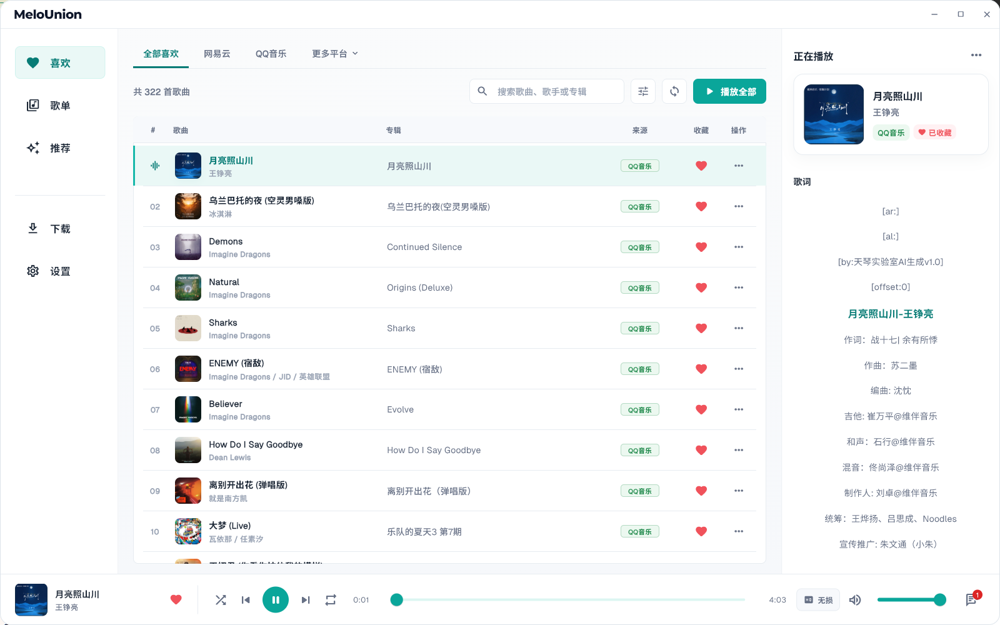
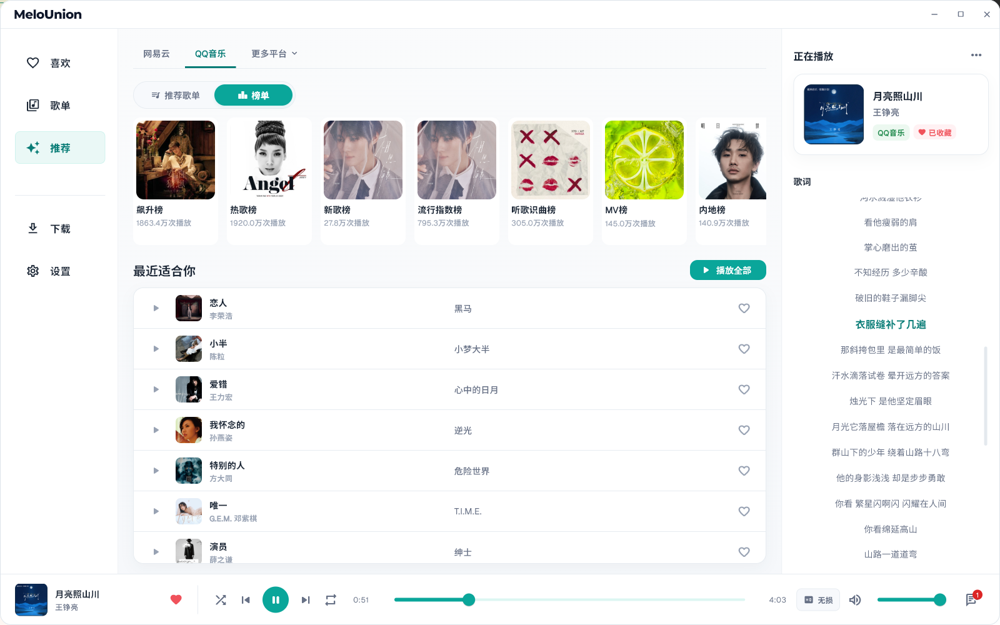
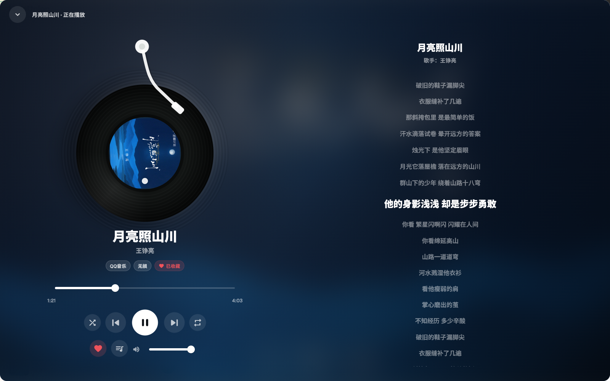
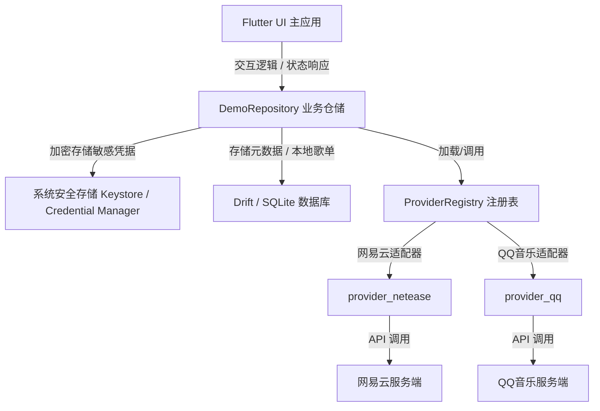
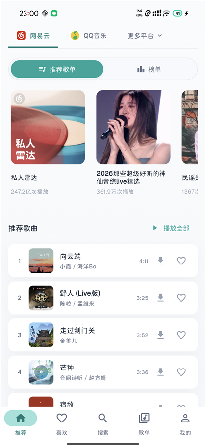
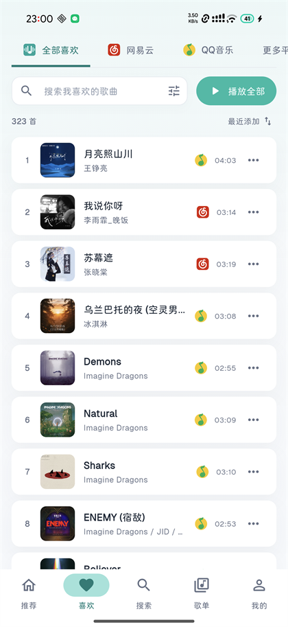

<p align="center">
  
</p>

<h1 align="center">MeloUnion 麦乐聚合音乐客户端</h1>

<p align="center">
  <a href="https://flutter.dev">
    
  </a>
  <a href="docs/">
    
  </a>
  <a href="LICENSE">
    
  </a>
</p>

> **MeloUnion (麦乐联合)** 是一款专为 **Windows + Android** 设计的**可扩展、多平台统一音乐客户端**。
>
> 核心设计理念是：将您在各大音乐平台（如网易云音乐、QQ 音乐等）的账号数据和喜欢列表，无缝聚合进一个**统一的虚拟歌单**，打破多客户端来回切换的壁垒，同时保留每首歌曲原始的平台归属与收藏状态。

---

## 📸 应用预览

### 1. 「全部喜欢」跨平台喜欢歌曲聚合视图


### 2. 个性化推荐与歌单广场（多来源混合推荐）


### 3. 沉浸式唱片机全屏播放器（歌词与播放控制）


---

## 🌟 核心特性

- 🔗 **多账号聚合「全部喜欢」**
  将网易云「我喜欢的音乐」与 QQ 音乐「我喜欢」以及未来接入的其他平台，在本地合并成一个**虚拟聚合歌单**，支持一键统一搜索、浏览与随机播放，且不生成多余的云端备份。
- 🎯 **收藏状态双向写回**
  统一的点赞（♥）交互：在本地歌单点赞将智能识别音轨原始平台，并实时**双向同步写回**对应的云端官方账号。
- 🌌 **沉浸式毛玻璃唱片机全屏播放**
  智能抓取当前歌曲的高清封面，利用 `BackdropFilter` 实现极高画质的**动态毛玻璃背景与复古黑胶唱片视觉**。配合 `RepaintBoundary` 进行视图渲染隔离，在提供高端视觉冲击的同时，保持极低的 CPU 占用。
- 🎙️ **智能歌词滚动与防冲突避让**
  实时高亮并动态自适应滚动居中歌词。当检测到用户手动拖拽或滑动歌词时，播放器会自动**避让静默 4 秒钟**，给用户留足阅读时间，之后再丝滑滑回当前进度。
- 🖥️📱 **桌面端 / 移动端自适应布局**
  宽屏状态下呈现高级的左右分栏面板（左侧大图控制、右侧歌词队列胶囊选项卡），窄屏/移动端下自适应堆叠并收起辅面板，提供一致的多端体验。
- 🛡️ **严格的数据隐私边界**
  所有账号的 Cookie 和 Token 凭证**仅保存在系统安全存储中**（如 Windows 凭据管理器 / Android KeyStore），不写入数据库、不进行明文传输、不随本地同步同步至公网，防止凭证泄露。

---

## 🏗️ 架构与可扩展性设计

MeloUnion 基于 **Clean Architecture (清洁架构)** 构建。每个音乐源均作为一个独立的 **Provider** 注册并由系统动态调度。

### 1. 系统数据流向



### 2. 核心包依赖结构
- **`app/`**：Flutter 应用壳，负责 UI 呈现、全局状态管理（Riverpod）及跨平台（Windows/Android）生命周期与原生桥接。
- **`packages/provider_contract/`**：核心抽象契约，定义了 `MusicProvider`、数据模型以及能力矩阵（Capabilities）。
- **`packages/music_domain/`**：核心业务模型，包含播放队列状态机、下载控制器及底层服务接口。
- **`packages/music_data/`**：本地数据存储与缓存层，基于 Drift 实现 SQLite 高性能访问、JSON 序列化与数据快照。
- **`packages/provider_netease/`** 与 **`packages/provider_qq/`**：针对网易云音乐和 QQ 音乐具体网络协议与接口的适配实现包。
- **`packages/just_audio_windows_patched/`**：Windows 平台音频播放的本地补丁包，通过 WinRT MediaPlayer 实现对 `just_audio_windows` 的底层覆盖与优化。

---

## 📱 Android 端说明

Android 端不是简单的桌面 UI 缩放版，而是围绕移动设备的使用场景做了原生能力补齐：

- **移动端自适应体验**：窄屏下使用移动端导航、迷你播放器与紧凑信息层级，适合单手浏览「全部喜欢」、推荐、搜索和播放队列。
- **原生后台播放链路**：通过 Kotlin 原生通道接入 `Media3 ExoPlayer` 与 `MediaSessionService`，支持播放队列加载、播放/暂停、上一首/下一首和状态回传。
- **系统媒体控制集成**：结合 `just_audio_background`、前台媒体服务和媒体按钮接收器，便于接入通知栏、锁屏和系统媒体控制入口。
- **安卓安全凭据存储**：网易云与 QQ 音乐 Cookie 通过 `EncryptedSharedPreferences` 写入 Android Keystore 保护的加密存储，不落明文数据库。
- **本地数据目录桥接**：Android Runner 通过 `melo_union/storage` 通道提供应用私有目录，供 Drift/SQLite 快照和本地缓存使用。
- **高刷新率优先**：启动时会优先选择设备可用的 90Hz/120Hz 显示模式，让列表滚动、歌词滚动和播放器动效更贴近移动端手感。

<table>
  <tr>
    <td align="center" width="33%">
      <br>
      <sub>移动端推荐</sub>
    </td>
    <td align="center" width="33%">
      <br>
      <sub>全部喜欢聚合</sub>
    </td>
    <td align="center" width="33%">
      <br>
      <sub>全屏播放器</sub>
    </td>
  </tr>
</table>

当前 Android 端主要面向真机调试与功能验证；正式发布前还需要补齐 release 签名、通知权限引导、机型兼容测试与应用商店分发配置。

---

## 📂 项目结构规划

```text
melo-union/
├── app/                        # Flutter 主应用壳 (含 Windows/Android Runner)
│   └── lib/src/
│       ├── bootstrap/          # 应用初始化与依赖注入 (如 DemoRepository, ProviderRegistry)
│       ├── design/             # UI 设计系统 Token 与全局主题
│       ├── fakes/              # 用于离线或开发模式的 Fake 服务与数据模拟
│       ├── features/           # 页面功能模块 (下载/全部喜欢/本地歌单/当前播放/源管理/推荐/搜索/设置等)
│       ├── layout/             # 壳布局组件 (响应式双端结构、侧边栏、播放条等)
│       ├── platform/           # 原生通道桥接 (如音频播放、系统音量控制)
│       ├── presentation/       # 全局状态管理与 Riverpod Provider 状态源
│       ├── router/             # 基于 GoRouter 的页面路由配置
│       └── widgets/            # 跨页面复用的 UI 原子与区块组件 (唱片、音轨行、封面缓存等)
├── packages/
│   ├── music_domain/           # 领域层：实体、值对象、用例与服务契约 (如播放队列、下载调度)
│   ├── music_data/             # 数据层：Drift/SQLite 本地存储实现、JSON 编解码与快照仓储
│   ├── provider_contract/      # 契约层：第三方音乐源提供者契约与 Registry 注册表
│   ├── provider_netease/       # 网易云适配包：实现登录、搜索、歌单喜欢与播放凭证解析
│   ├── provider_qq/            # QQ 音乐适配包：实现签名、搜索、喜欢列表与播放凭证解析
│   └── just_audio_windows_patched/ # 播放补丁：Windows 端 WinRT MediaPlayer 的本地 patches
├── docs/                       # 系统架构、ADR 记录及优化重构任务书
└── README.md                   # 本说明文件
```

---

## 🛠️ 构建与运行说明

### 1. 依赖工具准备
- **Flutter SDK**：`>= 3.19.0` (Dart `>= 3.3.0`)
- **C++ 编译环境** (仅 Windows 编译需要)：确保安装了 Visual Studio 的 "C++ 桌面开发" 工作负载。
- **Android SDK / Platform Tools** (仅 Android 编译需要)：建议通过 Android Studio 安装，并准备一台已开启 USB 调试的真机或可用模拟器。

### 2. 多 package 初始化
本仓库使用 Melos 对多包进行统一管理，在根目录下依次执行（若 `melos` 命令未加入系统 PATH，可使用 `dart pub global run melos` 代替）：
```bash
# 激活 Melos
dart pub global activate melos

# 统一拉取所有包 of dependencies 并关联本地引用
melos bootstrap
```

### 3. 本地数据库与序列化代码生成
本项目的部分数据持久化与 JSON 编解码采用 Drift 及其配套代码生成器。在开发涉及修改接口定义或表结构时，请在对应包目录下生成代码：
```bash
# 进入数据包目录
cd packages/music_data

# 执行单次代码生成
dart run build_runner build --delete-conflicting-outputs

# 或启动持续监听自动生成
dart run build_runner watch --delete-conflicting-outputs
```

### 4. 运行与验证
您可以根据需求在不同平台上启动应用调试：

#### 💻 运行 Windows 桌面端
```bash
cd app
flutter run -d windows
```

#### 📱 运行 Android 移动端
确保你的安卓真机已开启 USB 调试并连接电脑，或者已启动安卓模拟器：
```bash
# 检查设备连接
flutter devices

# 指定在安卓端启动
cd app
flutter run -d android
```

#### 🧪 运行单元测试
```bash
# 验证所有相关包的单元测试正确性
melos run test
```

---

## 🛡️ 数据隐私与安全政策

MeloUnion 极力保障您的账号凭据与会话安全，在开发和运行中严格执行以下三条安全防范守则：

> [!IMPORTANT]
> **敏感凭据本地零明文**
>
> 用户的 Cookie、Token 等登录凭据**仅存储于本地系统级别的安全加密存储区**，绝不以明文形式写入 SQLite 数据库文件，亦不参与任何 WebDAV 或第三方云盘服务（如 WebDAV）。

> [!TIP]
> **网络日志脱敏保护**
>
> 系统在调试输出（Console Log）中对所有请求的 `Cookie`、`Authorization` 头部以及扫码登录的临时 `Session ID` 进行了全局掩码处理，防止开发测试期间发生会话泄漏。

> [!WARNING]
> **开发环境防意外泄露**
>
> 本地开发期产生的临时 Cookie 缓存文件 (`*.cookie` / `*.session`)、本地数据库快照 (`*.sqlite*`) 及敏感配置文件 (`.env*`) 已在 [`.gitignore`](.gitignore) 中进行了全局忽略，切勿强制提交。

---

## 📋 非目标 (Non-Goals)
- 本项目不提供绕过会员付费限制、绕过数字版权管理 (DRM) 及绕过地区版权限制等功能。
- 首个稳定版暂不提供社交、MV、播客等附加模块，以确保客户端的纯粹与轻量。
