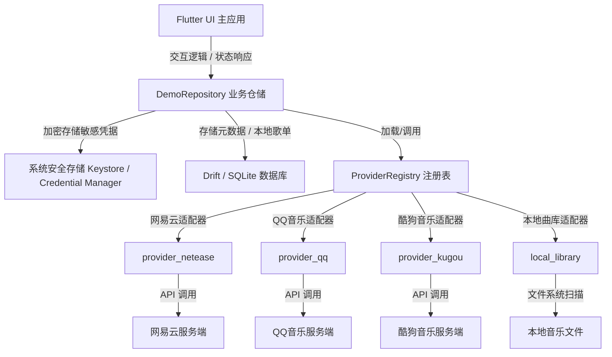
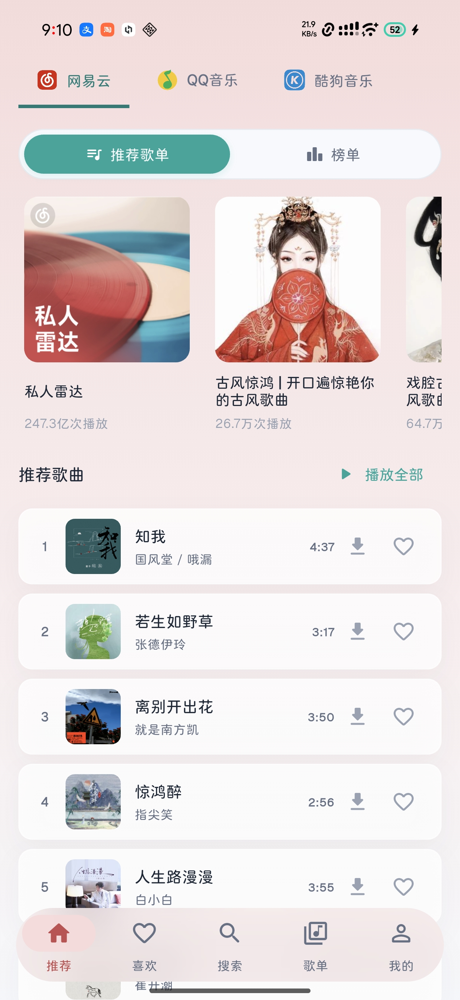
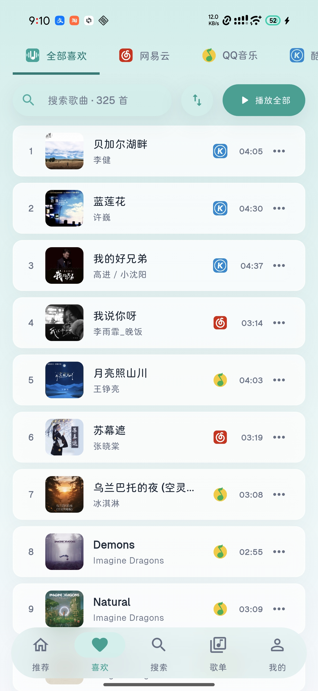
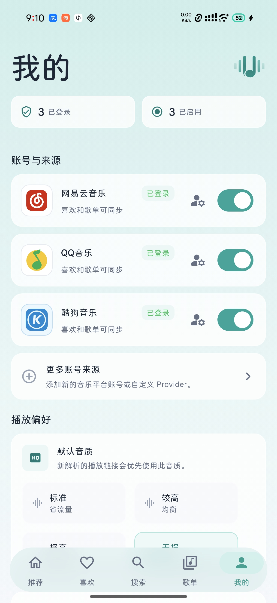

<p align="center">
  
</p>

<h1 align="center">MeloUnion 麦乐聚合音乐客户端</h1>

<p align="center">
  <a href="https://flutter.dev">
    
  </a>
  <a href="docs/">
    
  </a>
  <a href="LICENSE">
    
  </a>
  <a href="CHANGELOG.md">
    
  </a>
</p>

> **MeloUnion (麦乐联合)** 是一款专为 **Windows + Android** 设计的**可扩展、多平台统一音乐客户端**。
>
> 核心设计理念是：将您在各大音乐平台（如网易云音乐、QQ 音乐、酷狗音乐等）的账号数据和喜欢列表，无缝聚合进一个**统一的虚拟歌单**，打破多客户端来回切换的壁垒，同时保留每首歌曲原始的平台归属与收藏状态。

---

## 📸 应用预览

### 1. 「全部喜欢」跨平台喜欢歌曲聚合视图


### 2. 个性化推荐与歌单广场（多来源混合推荐）


### 3. 沉浸式唱片机全屏播放器（歌词与播放控制）


---

## 🌟 核心特性

- 🔗 **多账号聚合「全部喜欢」**
  将网易云「我喜欢的音乐」、QQ 音乐「我喜欢」与酷狗音乐收藏，在本地合并成一个**虚拟聚合歌单**，支持一键统一搜索、浏览与随机播放，且不生成多余的云端备份。
- 🎯 **收藏状态双向写回**
  统一的点赞（♥）交互：在本地歌单点赞将智能识别音轨原始平台，并实时**双向同步写回**对应的云端官方账号。
- 📂 **本地曲库管理（Windows）**
  Windows 桌面端支持多目录增量扫描本地音乐文件（MP3、FLAC、M4A/AAC、WAV、OGG/Opus、APE），自动读取内嵌标签、封面与歌词。扫描结果保存为 Drift 索引与稳定 UUID，音频文件保留在用户原目录不做拷贝。本地曲库作为独立的 `local` Provider 注册，可参与"全部喜欢"聚合、歌单、搜索与播放，并提供"按专辑"排序视图。
- 🎙️ **桌面悬浮歌词（Windows）**
  置顶原生桌面歌词窗口，使用 GDI+ 渲染双行同步歌词，可跨出应用拖动定位。支持锁定状态下鼠标穿透、hover 时显示控制按钮，以及从底部播放器一键开启/隐藏/解锁。
- 🔊 **跨端音频缓存**
  Android 保留边播边缓存，Windows 使用 loopback 应用代理将远端响应同时供播放器消费并写入本地缓存。缓存命中时优先使用本地文件，搜索、歌单、收藏和队列中可显示满足当前音质的缓存标识。设置页可查看和管理缓存容量。
- ⬇️ **跨来源下载与本地音乐管理**
  在喜欢、推荐、歌单或搜索结果中打开歌曲菜单即可发起下载；下载页集中展示下载队列与已保存的本地音乐，支持质量档位选择、开始/暂停/取消、重新下载与删除本地记录。
- 💾 **本地 / WebDAV 备份与恢复**
  设置页可导出标准 `.zip` 备份包，也可上传到 WebDAV；备份包含播放队列、本地歌单、下载记录、喜欢列表缓存与排序依据。账号备份为可选项，启用时会写入密码加密的账号保险箱。
- 🕒 **稳定的「全部喜欢」排序缓存**
  网易云与酷狗使用平台返回的精准喜欢时间；QQ 音乐使用本地喜欢时间账本，刷新后不会让旧歌排序漂移。应用会缓存 provider 原始收藏快照与最终虚拟歌单，离线启动也能立即展示上次结果。
- 🌌 **沉浸式毛玻璃唱片机全屏播放**
  智能抓取当前歌曲的高清封面，利用 `BackdropFilter` 实现极高画质的**动态毛玻璃背景与复古黑胶唱片视觉**。配合 `RepaintBoundary` 进行视图渲染隔离，在提供高端视觉冲击的同时，保持极低的 CPU 占用。
- 🎵 **智能歌词滚动与防冲突避让**
  实时高亮并动态自适应滚动居中歌词。当检测到用户手动拖拽或滑动歌词时，播放器会自动**避让静默 4 秒钟**，给用户留足阅读时间，之后再丝滑滑回当前进度。
- ▶️ **插播与队列管理**
  收藏列表、推荐歌单、侧边栏与全屏播放器队列均支持「下一首播放」按钮，将选中歌曲插入队列当前位置之后；队列条目具有稳定身份，支持拖拽排序与批量操作。
- 🖥️📱 **桌面端 / 移动端自适应布局**
  桌面端支持**可拖拽调整宽度的左侧侧边栏与右侧"当前播放"面板**，宽屏状态下呈现高级的左右分栏（左侧大图控制、右侧歌词队列胶囊选项卡）；窄屏/移动端下使用跟随页面来源色的透明 Dock、迷你播放器与固定槽位歌曲行，提供一致且对齐稳定的多端体验。
- 🛡️ **严格的数据隐私边界**
  所有账号的 Cookie 和 Token 凭证默认**仅保存在系统安全存储中**（如 Windows 凭据管理器 / Android KeyStore），不写入数据库、不进行明文传输。只有用户主动勾选账号备份时，才会进入密码加密的账号保险箱。

---

## 🏗️ 架构与可扩展性设计

MeloUnion 基于 **Clean Architecture (清洁架构)** 构建。每个音乐源均作为一个独立的 **Provider** 注册并由系统动态调度。

### 1. 系统数据流向



### 2. 核心包依赖结构
- **`app/`**：Flutter 应用壳，负责 UI 呈现、全局状态管理（Riverpod）及跨平台（Windows/Android）生命周期与原生桥接。
- **`packages/provider_contract/`**：核心抽象契约，定义了 `MusicProvider`、数据模型以及能力矩阵（Capabilities）。
- **`packages/music_domain/`**：核心业务模型，包含播放队列状态机、下载控制器、音频缓存存储及底层服务接口。
- **`packages/music_data/`**：本地数据存储与缓存层，基于 Drift 实现 SQLite 高性能访问、JSON 序列化、数据快照、喜欢时间账本、「全部喜欢」缓存与本地曲库索引持久化。
- **`packages/provider_netease/`**、**`packages/provider_qq/`** 与 **`packages/provider_kugou/`**：针对网易云音乐、QQ 音乐和酷狗音乐具体网络协议与接口的适配实现包。
- **`packages/just_audio_windows_patched/`**：Windows 平台音频播放的本地补丁包，通过 WinRT MediaPlayer 实现对 `just_audio_windows` 的底层覆盖与优化，包含本地文件 UTF-8 路径解码与 `IRandomAccessStream` 方案以支持中文路径播放。

---

## ⬇️ 全平台下载功能说明

MeloUnion 的下载功能是 Windows 与 Android 共用的系统能力，目标是建立可管理的"本地离线资料库"：用户可以从歌曲菜单创建下载任务，在下载页查看任务状态、本地保存位置和已下载曲目。

- **能力按来源判断**：只有 Provider 声明支持 `resolveDownload` 且当前账号/歌曲具备下载权限时，才会创建有效下载任务。
- **下载队列管理**：下载任务会经历等待、解析链接、下载中、暂停、完成、失败和取消等状态；失败任务可以重新开始，进行中的任务可以暂停或取消。
- **音质档位选择**：下载页提供标准、较高、极高、无损等质量档位，实际可用质量仍以音乐源返回的下载凭证为准。下载默认音质可在设置页调整，并纳入备份恢复链路跨重启保留。
- **本地音乐管理**：已完成内容会进入本地音乐列表，支持重新下载和删除本地记录；保存位置会展示在下载页，默认使用各平台应用支持目录下的 `MeloUnion/downloads` 或 `melo_union/downloads`。
- **版权边界**：下载功能不会绕过会员、版权、DRM 或地区限制；如果源站不提供可下载链接，MeloUnion 会按不可用处理。

---

## 💾 备份与恢复

MeloUnion 当前提供"备份 / 恢复"能力，而不是多端实时同步。用户可以在桌面端设置页或 Android「我的」页入口创建本地备份，也可以配置 WebDAV 后上传、列出、下载、恢复或删除远端备份。

- **备份格式**：新备份统一使用 `melo-union-backup-YYYYMMDD-HHMMSS.zip`，内部包含 `manifest.json`、`snapshot.json`，以及可选的 `account_vault.enc`。
- **数据快照**：`snapshot.json` 来自 `MeloDataSnapshot`，包含本地歌单、播放队列、下载记录、本地媒体元数据、provider 收藏快照、QQ 喜欢时间账本、最终「全部喜欢」缓存、provider 刷新状态与下载默认音质偏好。
- **账号保险箱**：账号备份默认关闭；启用时需要用户输入备份密码，使用 PBKDF2-HMAC-SHA256 + AES-GCM 加密网易云、QQ 音乐、酷狗登录态。备份密码不会保存。
- **恢复模式**：支持只恢复数据、只恢复账号、数据与账号都恢复。恢复数据前会自动创建当前状态的预恢复备份，降低误操作风险。
- **恢复后体验**：恢复完成后无需重启即可读取 `unifiedFavoritesCache` 展示上次「全部喜欢」；随后后台刷新 provider 数据，网易云 / 酷狗用平台精准喜欢时间校准，QQ 继续使用恢复出的本地 ledger。
- **WebDAV 范围**：WebDAV 配置保存在系统安全存储中，不写入备份包。v1 暂不实现 S3，也不备份实际音频文件。

---

## 📱 Android 端说明

Android 端不是简单的桌面 UI 缩放版，而是围绕移动设备的使用场景做了原生能力补齐：

- **移动端自适应体验**：窄屏下使用移动端导航、迷你播放器与紧凑信息层级，适合单手浏览「全部喜欢」、推荐、搜索和播放队列。
- **来源色透明 Dock**：底部 Dock 的背景、选中胶囊、图标填充、文字与按压反馈会跟随当前页面来源 token 变化，且不使用额外边框，保持更轻的玻璃感。
- **歌曲行固定槽位**：移动端歌曲列表的来源图标、时长与操作按钮使用固定槽位排布，避免不同 provider logo 透明边界或时长宽度导致视觉不齐。
- **后台播放与系统媒体控制**：移动端播放统一由 `just_audio_background` 接入系统媒体会话，支持通知栏、锁屏和系统媒体控制入口。
- **安卓通知权限桥接**：Android 13+ 播放前会请求通知权限，确保媒体播放通知和通知栏控制器可正常显示。
- **安卓安全凭据存储**：网易云、QQ 音乐与酷狗音乐登录凭据通过 `EncryptedSharedPreferences` 写入 Android Keystore 保护的加密存储，不落明文数据库。
- **Android SAF 备份导入导出**：本地备份文件使用系统文件选择器创建和读取 `.zip`，便于在聊天应用、文件管理器和云盘之间传递。
- **本地数据目录桥接**：Android Runner 通过 `melo_union/storage` 通道提供应用私有目录，供 Drift/SQLite 快照和本地缓存使用。
- **高刷新率优先**：启动时会优先选择设备可用的 90Hz/120Hz 显示模式，让列表滚动、歌词滚动和播放器动效更贴近移动端手感。

<table>
  <tr>
    <td align="center" width="25%">
      <br>
      <sub>移动端推荐</sub>
    </td>
    <td align="center" width="25%">
      <br>
      <sub>全部喜欢聚合</sub>
    </td>
    <td align="center" width="25%">
      <br>
      <sub>云端歌单</sub>
    </td>
    <td align="center" width="25%">
      <br>
      <sub>我的与来源</sub>
    </td>
  </tr>
</table>

当前 Android 端主要面向真机调试与功能验证；正式发布前还需要补齐 release 签名、通知权限引导、机型兼容测试与应用商店分发配置。

---

## 📂 项目结构规划

```text
melo-union/
├── app/                        # Flutter 主应用壳 (含 Windows/Android Runner)
│   └── lib/src/
│       ├── bootstrap/          # 应用初始化与依赖注入 (如 DemoRepository, ProviderRegistry)
│       ├── design/             # UI 设计系统 Token 与全局主题
│       ├── fakes/              # 用于离线或开发模式的 Fake 服务与数据模拟
│       ├── features/           # 页面功能模块
│       │   ├── all_favorites/  # 「全部喜欢」跨源聚合视图
│       │   ├── downloads/      # 下载管理与本地音乐
│       │   ├── local_library/  # 本地曲库扫描与管理 (Windows)
│       │   ├── local_playlists/# 本地歌单管理
│       │   ├── now_playing/    # 全屏/沉浸式播放器
│       │   ├── providers/      # 音乐源账号管理
│       │   ├── recommendations/# 个性化推荐与歌单广场
│       │   ├── search/         # 跨源搜索
│       │   └── settings/       # 设置与备份恢复
│       ├── layout/             # 壳布局组件 (可调整大小的响应式双端结构、侧边栏、播放条)
│       ├── platform/           # 原生通道桥接 (如音频播放、系统音量控制)
│       ├── presentation/       # 全局状态管理与 Riverpod Provider 状态源
│       ├── router/             # 基于 GoRouter 的页面路由配置
│       └── widgets/            # 跨页面复用的 UI 原子与区块组件 (唱片、音轨行、封面缓存、桌面歌词控制器等)
├── packages/
│   ├── music_domain/           # 领域层：实体、值对象、用例与服务契约 (如播放队列、下载调度、音频缓存存储)
│   ├── music_data/             # 数据层：Drift/SQLite 本地存储实现、JSON 编解码、快照、喜欢时间账本、「全部喜欢」缓存与本地曲库索引
│   ├── provider_contract/      # 契约层：第三方音乐源提供者契约与 Registry 注册表
│   ├── provider_netease/       # 网易云适配包：实现登录、搜索、歌单喜欢与播放凭证解析
│   ├── provider_qq/            # QQ 音乐适配包：实现签名、搜索、喜欢列表与播放凭证解析
│   ├── provider_kugou/         # 酷狗音乐适配包：实现扫码登录、收藏、搜索、歌单、播放、下载与歌词解析
│   └── just_audio_windows_patched/ # 播放补丁：Windows 端 WinRT MediaPlayer 本地 patches (含中文路径与 IRandomAccessStream 支持)
├── tooling/                    # 版本 bump 脚本、Inno Setup 安装包配置与调试工具
├── docs/                       # 系统架构、ADR 记录、项目日志及优化重构任务书
├── .github/workflows/          # GitHub Actions Release 自动构建 (Windows zip/MSIX/Installer + Android ABI APK)
└── README.md                   # 本说明文件
```

---

## 🛠️ 构建与运行说明

### 1. 依赖工具准备
- **Flutter SDK**：`>= 3.19.0` (Dart `>= 3.3.0`)
- **C++ 编译环境** (仅 Windows 编译需要)：确保安装了 Visual Studio 的 "C++ 桌面开发" 工作负载。
- **Android SDK / Platform Tools** (仅 Android 编译需要)：建议通过 Android Studio 安装，并准备一台已开启 USB 调试的真机或可用模拟器。

### 2. 多 package 初始化
本仓库使用 Melos 对多包进行统一管理，在根目录下依次执行（若 `melos` 命令未加入系统 PATH，可使用 `dart pub global run melos` 代替）：
```bash
# 激活 Melos
dart pub global activate melos

# 统一拉取所有包的 dependencies 并关联本地引用
melos bootstrap
```

### 3. 本地数据库与序列化代码生成
本项目的部分数据持久化与 JSON 编解码采用 Drift 及其配套代码生成器。在开发涉及修改接口定义或表结构时，请在对应包目录下生成代码：
```bash
# 进入数据包目录
cd packages/music_data

# 执行单次代码生成
dart run build_runner build --delete-conflicting-outputs

# 或启动持续监听自动生成
dart run build_runner watch --delete-conflicting-outputs
```

### 4. 运行与验证
您可以根据需求在不同平台上启动应用调试：

#### 💻 运行 Windows 桌面端
```bash
cd app
flutter run -d windows
```

#### 📱 运行 Android 移动端
确保你的安卓真机已开启 USB 调试并连接电脑，或者已启动安卓模拟器：
```bash
# 检查设备连接
flutter devices

# 指定在安卓端启动
cd app
flutter run -d android
```

#### 🧪 运行单元测试
```bash
# 验证所有相关包的单元测试正确性
melos run test
```

---

## 🚀 发布与 CI/CD

项目使用 GitHub Actions 自动构建发布产物，以 Git tag 触发：

- **Windows 产物**：`.zip` 免安装包、MSIX 安装包、Inno Setup `.exe` 安装程序。
- **Android 产物**：按 ABI 拆分的 APK（arm64-v8a、armeabi-v7a、x86_64）。
- **命名规范**：`MeloUnion-{tag}-{platform}-{variant}.{ext}`，下载后即可识别版本和平台。
- **Release Notes**：优先读取 `CHANGELOG.md` 当前版本小节；找不到时从 commit 自动生成。
- **本地版本管理**：使用 `tooling/bump_version.ps1`（Windows）或 `tooling/bump_version.sh`（Unix）同步更新 `pubspec.yaml` 和运行时版本常量 `app_version.dart`。

---

## 🛡️ 数据隐私与安全政策

MeloUnion 极力保障您的账号凭据与会话安全，在开发和运行中严格执行以下三条安全防范守则：

> [!IMPORTANT]
> **敏感凭据本地零明文**
>
> 用户的 Cookie、Token 等登录凭据**仅存储于本地系统级别的安全加密存储区**，绝不以明文形式写入 SQLite 数据库文件。备份账号时必须由用户主动选择并输入备份密码，凭据只会以加密后的 `account_vault.enc` 进入 zip 备份包。

> [!TIP]
> **网络日志脱敏保护**
>
> 系统在调试输出（Console Log）中对所有请求的 `Cookie`、`Authorization` 头部以及扫码登录的临时 `Session ID` 进行了全局掩码处理，防止开发测试期间发生会话泄漏。

> [!WARNING]
> **开发环境防意外泄露**
>
> 本地开发期产生的临时 Cookie 缓存文件 (`*.cookie` / `*.session`)、本地数据库快照 (`*.sqlite*`) 及敏感配置文件 (`.env*`) 已在 [`.gitignore`](.gitignore) 中进行了全局忽略，切勿强制提交。

---

## 🙏 参考与致谢

MeloUnion 在调研多音乐源协议、播放凭证解析与下载链路时，参考了 [guohuiyuan/go-music-dl](https://github.com/guohuiyuan/go-music-dl) 及其相关 [music-lib](https://github.com/guohuiyuan/music-lib) 的公开实现与社区经验，并在 Flutter / Dart 的 Provider 架构内重新适配相关链路。本仓库未直接 vendoring 上游 Go 源码或声明其 Go 包依赖；出于保守合规考虑，MeloUnion 按 [AGPL-3.0](LICENSE) 发布。

---

## 📋 非目标 (Non-Goals)
- 本项目不提供绕过会员付费限制、绕过数字版权管理 (DRM) 及绕过地区版权限制等功能。
- 首个稳定版暂不提供社交、MV、播客等附加模块，以确保客户端的纯粹与轻量。
- 当前备份功能不是实时多端同步；v1 不实现 S3，也不备份实际音频文件。
